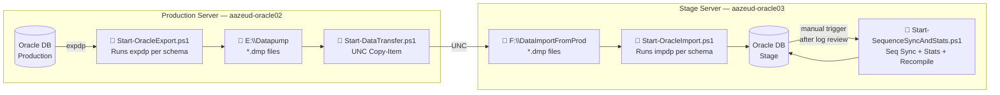

# Oracle Stage Refresh Automation

Automated PowerShell pipeline to refresh the Oracle Stage database (`aazeud-oracle03`) from Production (`aazeud-oracle02`) using Oracle Data Pump (`expdp` / `impdp`).

## Architecture



## Run Order

| Step | Server | Script | Trigger |
|---|---|---|---|
| 1 | `aazeud-oracle02` | `Start-OracleExport.ps1` | Manual / Scheduled |
| 2 | `aazeud-oracle02` | `Start-DataTransfer.ps1` | After export completes |
| 3 | `aazeud-oracle03` | `Start-OracleImport.ps1` | After transfer completes |
| 4 | `aazeud-oracle03` | `Start-SequenceSyncAndStats.ps1` | Manual — after reviewing import logs |

## Schemas Processed

`ASHLEY` · `CIM` · `DIS` · `EMANIFEST` · `FINANCE` · `LEAN` · `SQLORACLE` · `TAPLSQL`

## Script Locations on Servers

| Server | Path |
|---|---|
| `aazeud-oracle02` | `C:\Scripts\Export\` · `C:\Scripts\Transfer\` · `C:\Scripts\Import\` |
| `aazeud-oracle03` | `C:\Scripts\Import\` |

## Documentation

| Document | Description |
|---|---|
| [Pipeline Overview](docs/Pipeline-Overview.md) | Full architecture, data flow, and process diagrams |
| [Export Script](docs/Export-Script.md) | `Start-OracleExport.ps1` — parameters, exclusions, how to run |
| [Transfer Script](docs/Transfer-Script.md) | `Start-DataTransfer.ps1` — parameters, how to run |
| [Import Script](docs/Import-Script.md) | `Start-OracleImport.ps1` — parameters, exclusions, how to run |
| [Sequence Sync & Stats](docs/SequenceSync-Stats-Script.md) | `Start-SequenceSyncAndStats.ps1` — parameters, how to run |

## Quick Start

```powershell
# Step 1 — On aazeud-oracle02: Export (dry run first)
cd C:\Scripts\Export
.\Start-OracleExport.ps1 -DryRun
.\Start-OracleExport.ps1

# Step 2 — On aazeud-oracle02: Transfer
cd C:\Scripts\Transfer
.\Start-DataTransfer.ps1 -StageServer aazeud-oracle03 -DryRun
.\Start-DataTransfer.ps1 -StageServer aazeud-oracle03

# Step 3 — On aazeud-oracle03: Import
cd C:\Scripts\Import
.\Start-OracleImport.ps1 -DryRun
.\Start-OracleImport.ps1

# Step 4 — On aazeud-oracle03: After reviewing import logs
.\Start-SequenceSyncAndStats.ps1
```

## Requirements

- PowerShell 5.0+
- Oracle 19c (Standard Edition 2) — `sqlplus`, `expdp`, `impdp` in PATH
- Network access to admin shares (`c$`, `f$`) between servers
- `Set-ExecutionPolicy RemoteSigned -Scope LocalMachine` on both servers
