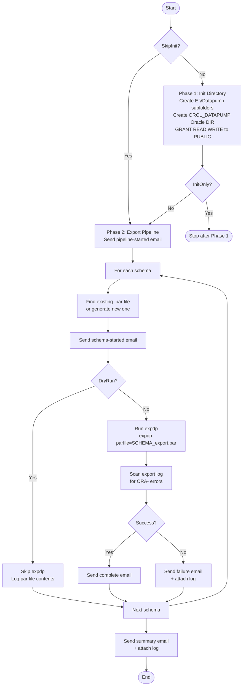

# Export Script — `Start-OracleExport.ps1`

**Runs on:** `aazeud-oracle02` (Production Server)  
**Location:** `C:\Scripts\Export\Start-OracleExport.ps1`  
**Config:** `C:\Scripts\Export\Config\ExportConfig.json`

## Purpose

Exports all 8 Oracle schemas from Production using `expdp` (Oracle Data Pump Export). Produces one `.dmp` file per schema in `E:\Datapump`, ready for transfer to Stage.

## Process Flow



## Parameters

| Parameter | Type | Default | Description |
|---|---|---|---|
| `-ConfigPath` | String | `.\Config\ExportConfig.json` | Path to config file |
| `-SkipInit` | Switch | `false` | Skip Phase 1 (dir already exists) |
| `-InitOnly` | Switch | `false` | Run Phase 1 only, then stop |
| `-DryRun` | Switch | `false` | Generate par files, skip `expdp` |

## Configuration — `ExportConfig.json`

| Key | Value |
|---|---|
| `OracleHome` | `E:\Oracle19CHome` |
| `ExportBaseDirectory` | `E:\Datapump` |
| `OracleDirectoryObject` | `ORCL_DATAPUMP` |
| `LogDirectory` | `E:\Datapump\Logs` |
| `RunLabel` | `AFIQARefresh` |

## Schemas & Exclusions

| Schema | Excluded Tables |
|---|---|
| ASHLEY | _(none)_ |
| CIM | _(none)_ |
| DIS | `PACOS_LOCATIONHISTORY`, `TTSUSERS`, `DISTRIBUTION_LIST`, `TTSMAPPINGS`, `TTSMODULES` |
| EMANIFEST | _(none)_ |
| FINANCE | _(none)_ |
| LEAN | _(none)_ |
| SQLORACLE | _(none)_ |
| TAPLSQL | _(none)_ |

> **DIS note:** These 5 tables contain Stage-environment-specific data (user mappings, routing config) that must not be overwritten by Production data.

## Common Export Parameters (applied to all schemas)

| Parameter | Value | Reason |
|---|---|---|
| `CLUSTER=N` | No RAC parallelism | Oracle SE2 — no RAC |
| `METRICS=YES` | Detailed timing | Performance monitoring |
| `COMPRESSION=ALL` | Compress dump | Reduce file size |
| `FLASHBACK_TIME=SYSTIMESTAMP` | Consistent snapshot | Data consistency |
| `TABLE_EXISTS_ACTION` | N/A (export only) | — |

## Output

| Output | Location |
|---|---|
| Dump files | `E:\Datapump\SCHEMA_MMMDD_YYYY_AFIQARefresh.dmp` |
| Par files | `E:\Datapump\SCHEMA\SCHEMA_export.par` |
| expdp logs | `E:\Datapump\SCHEMA\SCHEMA_export_YYYYMMDD.log` |
| Pipeline log | `E:\Datapump\Logs\OracleExport_YYYYMMDD_HHmmss.log` |

## How to Run

```powershell
cd C:\Scripts\Export

# Recommended: Phase 1 only first (safe — no data touched)
.\Start-OracleExport.ps1 -InitOnly

# Dry run — validates config, generates par files, sends emails, skips expdp
.\Start-OracleExport.ps1 -DryRun

# Skip Phase 1 (dirs already exist) + dry run
.\Start-OracleExport.ps1 -SkipInit -DryRun

# Full run
.\Start-OracleExport.ps1

# Skip Phase 1 + full export
.\Start-OracleExport.ps1 -SkipInit
```
