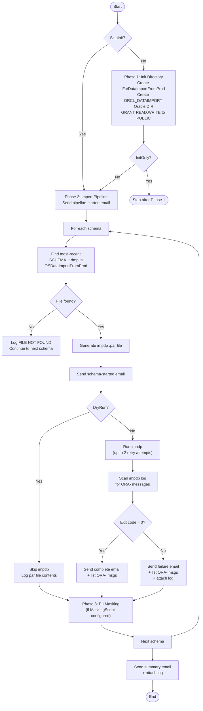

# Import Script — `Start-OracleImport.ps1`

**Runs on:** `aazeud-oracle03` (Stage Server)  
**Location:** `C:\Scripts\Import\Start-OracleImport.ps1`  
**Config:** `C:\Scripts\Import\Config\ImportConfig.json`

## Purpose

Imports all 8 Oracle schemas into the Stage database using `impdp` (Oracle Data Pump Import). Replaces existing data using `TABLE_EXISTS_ACTION=REPLACE`. Code objects (sequences, functions, procedures, views, packages) are excluded from import and handled separately by `Start-SequenceSyncAndStats.ps1`.

## Process Flow



## Parameters

| Parameter | Type | Default | Description |
|---|---|---|---|
| `-ConfigPath` | String | `.\Config\ImportConfig.json` | Path to config file |
| `-SkipInit` | Switch | `false` | Skip Phase 1 (Oracle DIR already exists) |
| `-InitOnly` | Switch | `false` | Run Phase 1 only, then stop |
| `-DryRun` | Switch | `false` | Generate par files, skip `impdp` and masking |

## Configuration — `ImportConfig.json`

| Key | Value |
|---|---|
| `OracleHome` | `E:\Oracle19CHome` |
| `ImportBaseDirectory` | `F:\DataImportFromProd` |
| `OracleDirectoryObject` | `ORCL_DATAIMPORT` |
| `LogDirectory` | `F:\DataImportFromProd\Logs` |

## Common Import Parameters (applied to all schemas)

| impdp Parameter | Value | Reason |
|---|---|---|
| `TABLE_EXISTS_ACTION` | `REPLACE` | Overwrite existing table data |
| `CLUSTER` | `N` | Oracle SE2 — no RAC |
| `METRICS` | `YES` | Detailed timing in log |
| `EXCLUDE=STATISTICS` | — | Re-gathered by standalone script |
| `EXCLUDE=USER` | — | Users already exist on Stage |
| `EXCLUDE=SEQUENCE` | — | Re-imported with prod values by standalone script |
| `EXCLUDE=FUNCTION` | — | Stage code objects preserved |
| `EXCLUDE=PROCEDURE` | — | Stage code objects preserved |
| `EXCLUDE=VIEW` | — | Stage code objects preserved |
| `EXCLUDE=PACKAGE` | — | Stage code objects preserved |
| `EXCLUDE=ROLE_GRANT` | — | Stage role assignments preserved |
| `EXCLUDE=PROCOBJ` | — | Excludes all packaged objects |
| `TRANSFORM=DISABLE_ARCHIVE_LOGGING:Y` | — | Faster import (no redo logging) |
| `DATA_OPTIONS=SKIP_CONSTRAINT_ERRORS` | — | Continue on FK/constraint violations |

## Per-Schema Exclusions

### DIS Schema

| Type | Excluded Objects |
|---|---|
| **Index** | `IDX_PACOS_HOSAVAILPAST` |
| **Tables** | `PACOS_LOCATIONHISTORY`, `TTSUSERS`, `DISTRIBUTION_LIST`, `TTSMAPPINGS`, `TTSMODULES` |

> **Why:** These 5 tables contain Stage-specific dispatch routing/user data that must not be overwritten by Production values.

## ORA- Messages in Email

Every schema completion email (success **and** failure) includes a full list of ORA- messages found in the impdp log (up to 50 lines). This allows DBAs to review warnings without opening log files.

> ℹ️ Import success is determined by **exit code only** — not by presence of ORA- messages. `ORA-31684` (object already exists) is a common non-fatal warning from `impdp`.

## PII Masking

Each schema in `ImportConfig.json` has a `MaskingScript` field. If set to a `.sql` file path, it is executed via SQL*Plus after a successful import. If empty or file not found, masking is silently skipped.

## Output

| Output | Location |
|---|---|
| Par files | `F:\DataImportFromProd\SCHEMA\SCHEMA_import.par` |
| impdp logs | `F:\DataImportFromProd\SCHEMA\SCHEMA_import_YYYYMMDD_HHmmss.log` |
| Pipeline log | `F:\DataImportFromProd\Logs\OracleImport_YYYYMMDD_HHmmss.log` |

## How to Run

```powershell
cd C:\Scripts\Import

# Phase 1 only — creates Oracle DIRECTORY object (safe)
.\Start-OracleImport.ps1 -InitOnly

# Dry run — validates config, generates par files, sends emails, skips impdp
.\Start-OracleImport.ps1 -DryRun

# Full run
.\Start-OracleImport.ps1

# Skip Phase 1 (dir already exists)
.\Start-OracleImport.ps1 -SkipInit
```
