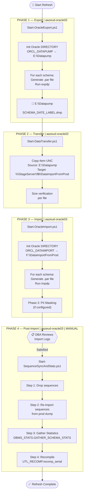
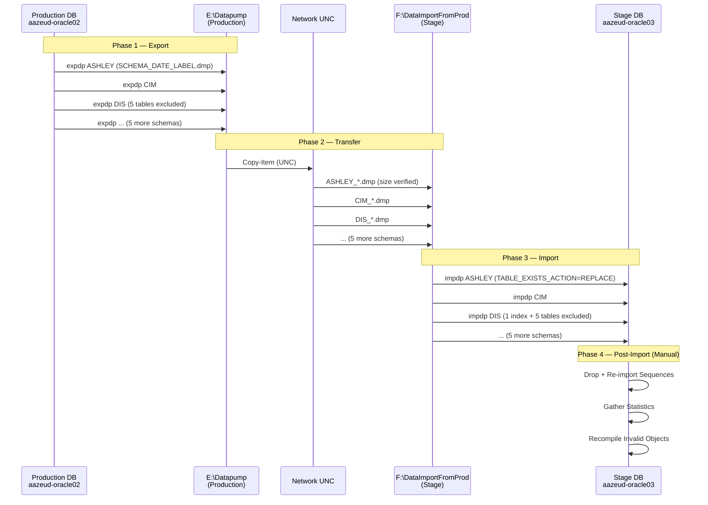

# Pipeline Overview — Oracle Stage Refresh

## Purpose

This pipeline automates the periodic refresh of the Oracle Stage database (`aazeud-oracle03`) from Production (`aazeud-oracle02`). It replaces the manual bat file/SQL*Plus approach with a fully logged, email-notified PowerShell pipeline.

## Pipeline Flow

## Data Flow

## Server & Component Reference

| Component | Value |
|---|---|
| Production Server | `aazeud-oracle02` |
| Stage Server | `aazeud-oracle03` |
| Oracle Home (both) | `E:\Oracle19CHome` |
| Export Dump Directory | `E:\Datapump` |
| Export Logs | `E:\Datapump\Logs` |
| Stage Import Directory | `F:\DataImportFromProd` |
| Import Logs | `F:\DataImportFromProd\Logs` |
| Oracle Export DIR Object | `ORCL_DATAPUMP` |
| Oracle Import DIR Object | `ORCL_DATAIMPORT` |
| Dump File Pattern | `SCHEMA_MMMDD_YYYY_RUNLABEL.dmp` |

## Email Notifications

Every script sends HTML emails at each key event:

| Event | Recipients |
|---|---|
| Pipeline started | DBA + Business |
| Per-schema start | DBA + Business |
| Per-schema complete (with ORA- list) | DBA + Business |
| Per-schema failure (with log attached) | DBA only |
| Pipeline summary | DBA + Business |
| Critical error (pipeline stopped) | DBA only |
