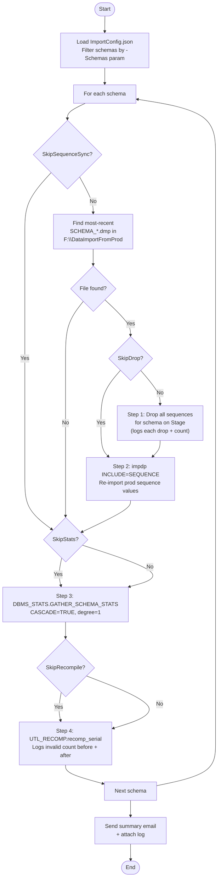

# Sequence Sync & Statistics Script — `Start-SequenceSyncAndStats.ps1`

**Runs on:** `aazeud-oracle03` (Stage Server)  
**Location:** `C:\Scripts\Import\Start-SequenceSyncAndStats.ps1`  
**Config:** `C:\Scripts\Import\Config\ImportConfig.json`

## Purpose

This is a **manually-triggered** post-import script. Run it **after** you have reviewed the `impdp` log files from `Start-OracleImport.ps1` and are satisfied the import is acceptable (even if some ORA- warnings were ignored).

It performs four steps per schema:

| Step | Action | Oracle API Used |
|---|---|---|
| **1** | Drop all existing sequences on Stage | `EXECUTE IMMEDIATE 'DROP SEQUENCE'` |
| **2** | Re-import sequences from production dump | `impdp INCLUDE=SEQUENCE` |
| **3** | Gather schema statistics | `DBMS_STATS.GATHER_SCHEMA_STATS` |
| **4** | Recompile invalid objects | `UTL_RECOMP.recomp_serial` |

> **Why sequences are excluded from main import and synced separately:**  
> Oracle `impdp` has no `SEQUENCE_EXISTS_ACTION` parameter. If sequences are imported while they already exist, the import fails. The only safe approach is to drop them first, then re-import from the prod dump so Stage gets exact production `LAST_NUMBER` values.

## Process Flow



## Parameters

| Parameter | Type | Default | Description |
|---|---|---|---|
| `-Schemas` | String[] | All schemas | Limit to specific schemas e.g. `ASHLEY,CIM` |
| `-ConfigPath` | String | `.\Config\ImportConfig.json` | Path to config file |
| `-SkipDrop` | Switch | `false` | Skip Step 1 — don't drop sequences before importing |
| `-SkipSequenceSync` | Switch | `false` | Skip Steps 1 & 2 — only gather stats + recompile |
| `-SkipStats` | Switch | `false` | Skip Step 3 — no statistics gather |
| `-SkipRecompile` | Switch | `false` | Skip Step 4 — no recompile |
| `-DryRun` | Switch | `false` | Validate config, skip all SQL and impdp execution |

## Step Details

### Step 1 — Drop Sequences

Queries `dba_sequences` for all sequences owned by the schema and drops them one by one using `EXECUTE IMMEDIATE`. Each drop is logged individually. If an individual drop fails (non-fatal), it logs a `WARN` and continues to the next sequence.

```sql
-- Reports at end:
SEQ_DROP: Dropped 47 sequences from ASHLEY
```

### Step 2 — Import Sequences (`INCLUDE=SEQUENCE`)

Generates a minimal `.par` file and runs `impdp`:
```
INCLUDE=SEQUENCE
CLUSTER=N
METRICS=YES
```
This re-creates all sequences with their production `LAST_NUMBER` values.

### Step 3 — Gather Statistics

```sql
DBMS_STATS.GATHER_SCHEMA_STATS(
    ownname => 'ASHLEY',
    cascade => TRUE,      -- includes table + index stats
    options => 'GATHER',
    degree  => 1          -- SE2 safe: no parallel
);
```
Logs start and end timestamps from Oracle.

### Step 4 — Recompile Invalid Objects

```sql
-- Reports invalid count before and after:
RECOMP: Invalid objects before : 14
RECOMP: Invalid objects after  : 0
RECOMP: Successfully fixed     : 14
RECOMP: All objects compiled successfully.
```
Uses `UTL_RECOMP.recomp_serial` — Oracle's built-in serial recompiler, SE2 compatible (no parallel degree).

## How to Run

```powershell
cd C:\Scripts\Import

# Full run — all schemas, all steps
.\Start-SequenceSyncAndStats.ps1

# Specific schemas only
.\Start-SequenceSyncAndStats.ps1 -Schemas ASHLEY,CIM,DIS

# Skip drop — re-import sequences without dropping first
.\Start-SequenceSyncAndStats.ps1 -SkipDrop

# Stats + recompile only (skip all sequence work)
.\Start-SequenceSyncAndStats.ps1 -SkipSequenceSync

# Sequence sync only — skip stats and recompile
.\Start-SequenceSyncAndStats.ps1 -SkipStats -SkipRecompile

# Recompile only
.\Start-SequenceSyncAndStats.ps1 -SkipSequenceSync -SkipStats

# Dry run — safe to validate without executing anything
.\Start-SequenceSyncAndStats.ps1 -DryRun
```

## Output

| Output | Location |
|---|---|
| Sequence par files | `F:\DataImportFromProd\SCHEMA\SCHEMA_seqsync.par` |
| impdp sequence logs | `F:\DataImportFromProd\SCHEMA\SCHEMA_seqimport_TIMESTAMP.log` |
| Pipeline log | `F:\DataImportFromProd\Logs\SeqSyncStats_YYYYMMDD_HHmmss.log` |

## Summary Email

The final summary email shows per-schema results for all 4 steps:

| Schema | Step 1 - Drop Seq | Step 2 - Seq Import | Step 3 - Statistics | Step 4 - Recompile |
|---|---|---|---|---|
| ASHLEY | ✔ OK | ✔ OK | ✔ OK | ✔ OK |
| DIS | ✔ OK | ✔ OK | ✔ OK | ✔ OK |
