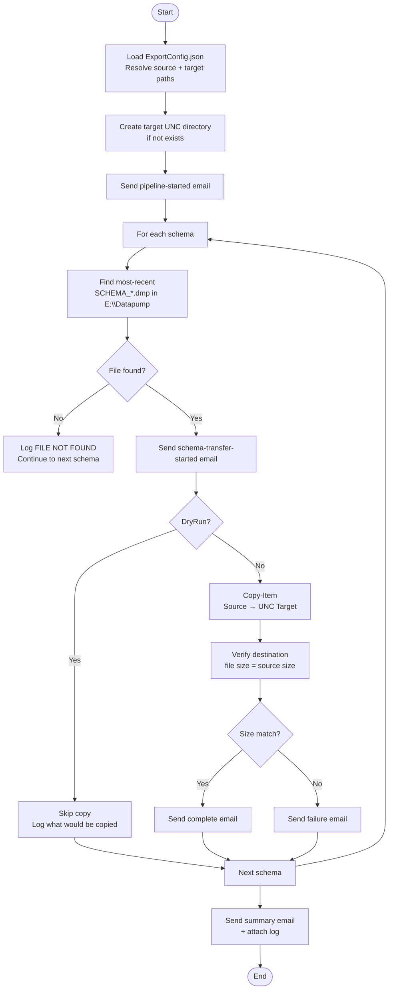

# Transfer Script — `Start-DataTransfer.ps1`

**Runs on:** `aazeud-oracle02` (Production Server)  
**Location:** `C:\Scripts\Transfer\Start-DataTransfer.ps1`  
**Config:** `C:\Scripts\Export\Config\ExportConfig.json` (shared with export)

## Purpose

Copies all schema `.dmp` files from the Production export directory (`E:\Datapump`) to the Stage server import directory (`\\StageServer\f$\DataImportFromProd`) over UNC using PowerShell `Copy-Item`. Verifies file size at destination after each copy.

Source files are **never deleted** after transfer.

## Process Flow



## Parameters

| Parameter | Type | Required | Default | Description |
|---|---|---|---|---|
| `-StageServer` | String | ✅ Yes | — | Hostname of the Stage server |
| `-ConfigPath` | String | No | `..\Export\Config\ExportConfig.json` | Path to ExportConfig.json |
| `-DryRun` | Switch | No | `false` | Show what would transfer, skip `Copy-Item` |
| `-TargetBasePath` | String | No | `\\StageServer\f$\DataImportFromProd` | Override target UNC path |

## Source & Target

| | Path |
|---|---|
| **Source** | `E:\Datapump\SCHEMA_*.dmp` (most recent per schema) |
| **Target** | `\\<StageServer>\f$\DataImportFromProd\` (auto-created if absent) |

> The script always picks the **most recently written** `.dmp` file for each schema — no hardcoded filenames.

## File Selection Logic

For each schema, the script runs:
```powershell
Get-ChildItem -Path E:\Datapump -Filter "SCHEMA_*.dmp" |
    Sort-Object LastWriteTime -Descending |
    Select-Object -First 1
```

## Size Verification

After every `Copy-Item`, source and destination sizes (in MB) are compared:
- ✅ Match → Transfer marked successful
- ❌ Mismatch → Transfer marked failed, failure email sent, pipeline continues to next schema

## How to Run

```powershell
cd C:\Scripts\Transfer

# Dry run — shows what would be transferred, sends emails, no files copied
.\Start-DataTransfer.ps1 -StageServer aazeud-oracle03 -DryRun

# Standard transfer to \\aazeud-oracle03\f$\DataImportFromProd
.\Start-DataTransfer.ps1 -StageServer aazeud-oracle03

# Override target path
.\Start-DataTransfer.ps1 -StageServer aazeud-oracle03 -TargetBasePath "\\aazeud-oracle03\e$\Import"

# Transfer to a different stage server
.\Start-DataTransfer.ps1 -StageServer aazeud-oracle-uat
```

## Output

| Output | Location |
|---|---|
| Pipeline log | `E:\Datapump\Logs\DataTransfer_YYYYMMDD_HHmmss.log` |
| Transferred files | `\\StageServer\f$\DataImportFromProd\SCHEMA_*.dmp` |
